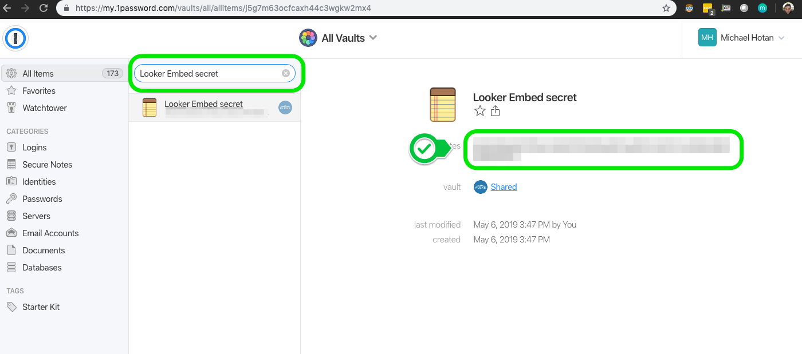

FLEXE fork of looker_embed_sso_examples
===================
Example code to use the Ruby Embed SSO API in various languages

 ### [Link to offical Looker Single Sign-on Embedding documentation](https://docs.looker.com/reference/embedding/sso-embed)
 
 ### [Link to SSO URL build testing tool](https://fabio-looker.github.io/looker_sso_tool)
 
 FLEXE Specific Documentation
 =======================================
 
 ## Validating SSO Embed
 
 In order to identify whether dashboard 9 will work with SSO embedded dashboards
 Reference: [Looker Single Sign-on (SSO) Embedding](https://docs.looker.com/reference/embedding/sso-embed)
 
 ### Identify Looker Embed Secret in FLEXE 1Password
 
 
 
 ### Run command to generate URL
 
 ```bash
 LOOKER_EMBED_SECRET=${LOOKER_EMBED_SECRET} FLEXE_COMPANY_ID=${PRODUCTION_COMPANY_ID} ruby flexe_example.rb
 ```  
 
 or 
 
 ```bash
 export LOOKER_EMBED_SECRET=${LOOKER_EMBED_SECRET}
 export FLEXE_COMPANY_ID=${PRODUCTION_COMPANY_ID}
 ruby flexe_example.rb
 ```
 
 If url renders a dashboard specific to that company id then we are all set

